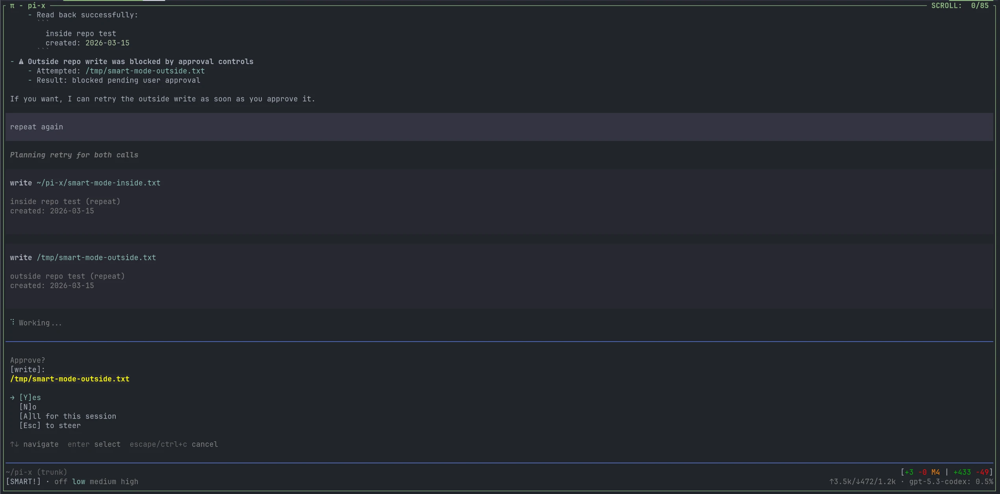

# Shitty Extensions

for [shittycodingagent.ai](https://shittycodingagent.ai/).

  

This repo currently contains the following extension(s):

| name | description | dependencies |
| --- | --- | --- |
| [`status-bar`](extensions/status-bar/README.md) | **Required shared dependency** for other status-producing extensions in this repo. Install this first. | |
| [`no-reflection`](extensions/no-reflection/README.md) | Removes pi's built-in documentation reference block from the agent system prompt without dumping the prompt anywhere. Disable with `PI_NO_REFLECTION=false`, `no`, `n`, or `0`. | |
| [`switch-thinking`](extensions/switch-thinking/README.md) | Adds fast keyboard workflows for thinking modes: `Ctrl+Alt+T` opens a picker, and `Ctrl+T` cycles your saved favorites. | `status-bar` |
| [`safe-mode`](extensions/safe-mode/README.md) | Intercepts tool calls and enforces approval policies with four modes: `paranoid`, `reader`, `smart`, and `yolo`. | `status-bar`, `bash-parser` |
| [`repo-stats`](extensions/repo-stats/README.md) | Publishes first-line repo info (`path (branch)` and dirty totals like `+150/-200`) for the status bar. | `status-bar` |
| [`skill-stats`](extensions/skill-stats/README.md) | Publishes `SKILLS: n/m` for unique `SKILL.md` files successfully read in the current session. | `status-bar` |
| [`http`](extensions/http/README.md) | Adds an `http` tool backed by Node native fetch, with HTTPie-like structured request fields, curl-compatible args support, and optional web-to-Markdown (`webToMd`) conversion via `pandoc`. | `cheerio`, `pandoc` for `http_md` |
| [`sqlite`](extensions/sqlite/README.md) | Adds a `sqlite` query tool for file-backed and in-memory databases, with read-only/mutating SQL classification for safe-mode integration. | `sqlite3` CLI |
| [`interactive-bash`](extensions/interactive-bash/README.md) | Runs selected user `!` commands in a true interactive terminal (stdin works for prompts, sudo password entry, and interactive scripts). | |
| [`git`](extensions/git/README.md) | Adds a `git` tool and `/git` command with compact porcelain `status` output (`git status --porcelain=v1 -b`) plus filtered/range-limited `log` support. | `git` CLI |
| [`pi-ui`](extensions/pi-ui/README.md) | UI tweaks extension (currently a colorful configurable working indicator animation). | |
| [`pi-nvim`](extensions/pi-nvim/README.md) | Unix-socket bridge for sending prompts into a running pi session from compatible Neovim clients. | compatible Neovim plugin |
| [`attension-core`](extensions/attension-core/README.md) | Minimal attention bell: emits terminal BEL (`\u0007`) on `agent_end`, with a short cooldown and a `/attension-core-test` command. | |
| [`save`](extensions/save/README.md) | Adds a `/save` command to write the latest assistant response to Markdown (`/save` or `/save file.md`). | |

also check the [skills repo](https://github.com/dector/skills).

## Install policy for pi agents

When installing extensions from this repository, pi agents should use the standard pi extension layout:

1. **Install from source directory** (not bundled artifacts).
2. Copy the full extension folder to one of:
   - Global: `~/.pi/agent/extensions/<name>/`
   - Project-local: `.pi/extensions/<name>/`
3. Ensure `index.ts` exists at the extension root (or `<name>/index.ts`).
4. Run `/reload` after copying/updating the extension.
